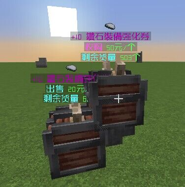
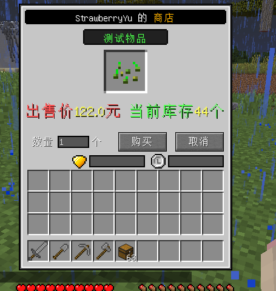
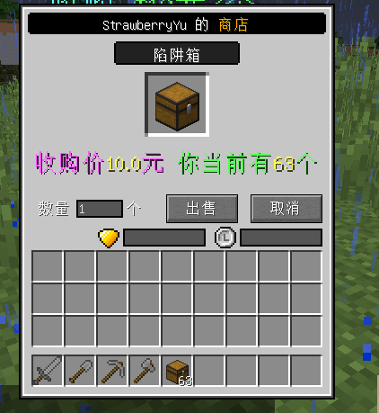
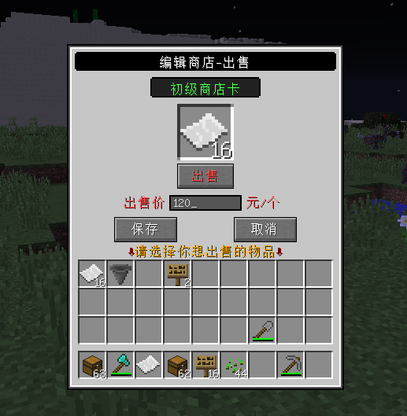

**一款基于QuickShop魔改的、使用简单、配合Mod套模型的商店插件!**

---

# 插件简介

1. 基于QuickShop修改，完美使用箱子存储，不怕丢数据！不怕卡服！
2. 插件简单易用，飞速上手！
3. 箱子存储，支持漏斗自动补货收货，完美体验！
4. 配合Mod给商店套模型，并能显示悬浮文字和商品模型！
5. 自带龙核界面，界面化编辑商店、购买、收购！
6. 兼容原生QuickShop附属！
7. 可以设置无限商店，从而作为系统商店！
8. 商店卡配置多样，更多圈钱方式！不同商店不同模型、不同税率、不同显示内容！











---

# 价格


---

# 开始使用

**购买插件**
请找qq 2332742172 或者 2574371790 购买！

**前置插件/Mod**

1. **[必备MOD放在客户端！！！！]** chestshopmod最新版**(群文件下载)**
2. **[必备MOD放在客户端！！！！]** geckolib-forge-1.12.2-3.0.31**(群文件下载)**
3. **[必备插件放在服务器！！！]** BerryLib 最新版
4. **[必备插件放在服务器！！！]** Vault合适版本
5. **[二选一]** DragonCore(龙核) 或者 GermPlugin(萌芽)

**售后群操作**

0、 先去群文件文件夹下载BerryShopPro最新版！放到plugins文件夹下！

1、 在购买了BerryPetPlus插件后，在群内输入 `list` 查看自己是否已经拥有该插件，没有请找草莓为您添加。

2、 在售后群输入 `download` 指令，获得最新版的BerryLib下载地址，点击下载。

3、 在售后群输入 `unbind` 指令，解绑一次，这样开服时便会自动绑定ip，同理以后服务器ip变动也要输入。

4、 将BerryLib放入服务端的plugins文件夹，启动服务器，待生成BerryLib文件夹后，关闭服务器。

5、 在BerryLib文件夹中的config.yml文件中，填写您的QQ和插件名字，例如下面这样：

```yaml
#您购买的qq号
qq: '您购买的qq号'
```

6、 开启服务器！


---

# 插件配置

龙核GUI配置参考gui/dragoncore文件夹，自行修改即可。

商店卡配置如下

商店卡右键地面即可生成商店

客户右键商店即可打开购买/收购界面

商店主人shift+左键删除商店

shift+右键编辑商店（手上拿漏斗时不会打开，因为为了让他防漏斗）

``` yaml
#该文件配置一个商店物品
#文件名字是商店id
#商店物品识别物品名字
#拿着商店卡右键地面即可生成商店
#然后再shift+右键即可打开商店设置
#shift+左键删除商店

#识别仅仅匹配名字！
#识别仅仅匹配名字！
#识别仅仅匹配名字！
#请不要让你的玩家能够更改带颜色的物品名字！
#请不要让你的玩家能够更改带颜色的物品名字！
#请不要让你的玩家能够更改带颜色的物品名字！


#物品配置
item:
  #物品名字
  #不要跟其他商店重复！！！！
  #不要跟其他商店重复！！！！
  #不要跟其他商店重复！！！！
  #不要跟其他商店重复！！！！
  name: '&a初级商店卡'
  #物品type
  type: 'PAPER'
  #lore
  lore:
    - '&b初级商店卡!'
    - '&a右键放出初级商店'
    - '&a需要权限example.use使用'
    - '&a放置需要消耗100金币'
    - '&a该商店为出售商店'
    - '&a出售货物时收取50%税'
    #支持papi 来写绑定这些东西
    - '&c已绑定: %player_name%'

#使用该商店所需要的权限
#删除该节点则不需要权限
permissions:
  - 'example.use'

#放置该商店需要消耗的金币
#删除则不需要
cost: 100

#该商店是出售商店还是收购商店？
#true代表出售商店
#false代表收购商店
isSell: true

#该商店出售货物时的税收
#0.5代表出售获得100元时 自己只获得(100 * 50% = 50)元
#当商店是收购商店时
#一个玩家以100元出售一个物品到商店 他自己只会获得50元
tax: 0.5

#商店模型设置
model:
  #模型名字
  name: 'shop'
  #模型上面显示的文字
  info:
    - '&a初级商店'
    - '{0}'
    - '&b出售 &a{1}元/个'
    - '&b剩余货量 &a{2}个'
  #在模型上方显示文字的偏移量
  infoOffsetY: 0.3

  #在模型上方显示商品图标的偏移量
  itemOffset:
    x: 0.0
    y: 1.3
    z: 0.0

  #在模型上方显示商品图标的旋转角度
  rotation:
    yaw: 90
    pitch: 30

  #在模型上方显示商品图标的大小
  scale: 1
```

---

# 插件命令

/bshopp reload ---重载

/bshopp unlimited --将鼠标指针指着的商店设置为无限商店

/bshopp give 玩家id[Tab自动补全] 商店卡id[Tab自动补全] 数量[可省略 默认为1] --给予指定玩家商店卡


---

