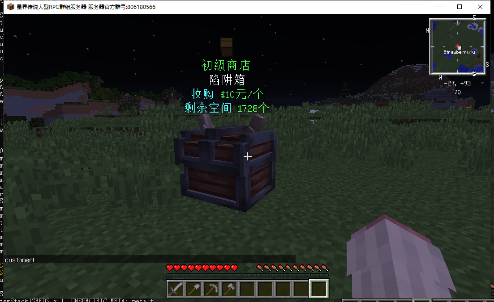

**一款基于QuickShop魔改的、使用简单、配合Mod套模型的商店插件!**

---

# 插件简介

1. 基于QuickShop修改，完美使用箱子存储，不怕丢数据！不怕卡服！
2. 插件简单易用，飞速上手！
3. 箱子存储，支持漏斗自动补货收货，完美体验！
4. 配合Mod给商店套模型，并能显示悬浮文字和商品模型！
5. 自带龙核界面，界面化编辑商店、购买、收购！
6. 兼容原生QuickShop附属！
7. 可以设置无限商店，从而作为系统商店！
8. 商店卡配置多样，更多圈钱方式！不同商店不同模型、不同税率、不同显示内容！
9. 购买即送模型+贴图资源，开箱即用！
10. 暂时只支持龙核！！！！





---

# 价格

**原价148！折扣价128！DS插件用户、日月插件用户、草莓插件用户享受折扣价！**
**原BerryPlayerShop用户折扣价80！**

---

# 开始使用

**购买插件**
请找qq 2332742172 或者 2574371790 购买！

**前置插件/Mod**

1. **[必备MOD放在客户端！！！！]** chestshopmod最新版**(群文件下载)**
2. **[必备MOD放在客户端！！！！]** geckolib-forge-1.12.2-3.0.31**(群文件下载)**
3. **[必备插件放在服务器！！！]** BerryLib 最新版
4. **[必备插件放在服务器！！！]** Vault合适版本
5. **[必备插件放在服务器！！！]** DragonCore(龙核)

**售后群操作**

0、先联系草莓（群主）给你账号添加插件

1、首先在群文件的 加载器[最新版] 文件夹下下载AckManLoader和BerryLib

2、放入plugins并启动服务器，在AckManLoader的config中填写您的token和想要加载的插件名字（在网站查看）版本填auto,例如如下插件则填写


```yaml
authorisation:
  # 用户令牌
  token: "xxxxxxxxxxxxxxxxxxxxxxx"
  plugins:
    # 插件名字："版本"
    BerryShopPlus: "auto"
```

3、重启服务器即可加载插件

4、解绑在网站完成


网站地址为 http://www.ackman.cn/

---

# 插件配置

龙核GUI配置参考gui/dragoncore文件夹，自行修改即可。

商店卡配置如下

商店卡右键地面即可生成商店

客户右键商店即可打开购买/收购界面

商店主人shift+左键删除商店

shift+右键编辑商店（手上拿漏斗时不会打开，因为为了让他防漏斗）

``` yaml
#该文件配置一个商店物品
#文件名字是商店id
#商店物品识别物品名字
#拿着商店卡右键地面即可生成商店
#然后再shift+右键即可打开商店设置
#shift+左键删除商店

#识别仅仅匹配名字！
#识别仅仅匹配名字！
#识别仅仅匹配名字！
#请不要让你的玩家能够更改带颜色的物品名字！
#请不要让你的玩家能够更改带颜色的物品名字！
#请不要让你的玩家能够更改带颜色的物品名字！


#物品配置
item:
  #物品名字
  #不要跟其他商店重复！！！！
  #不要跟其他商店重复！！！！
  #不要跟其他商店重复！！！！
  #不要跟其他商店重复！！！！
  name: '&a初级商店卡'
  #物品type
  type: 'PAPER'
  #lore
  lore:
    - '&b初级商店卡!'
    - '&a右键放出初级商店'
    - '&a需要权限example.use使用'
    - '&a放置需要消耗100金币'
    - '&a该商店为出售商店'
    - '&a出售货物时收取50%税'
    #支持papi 来写绑定这些东西
    - '&c已绑定: %player_name%'

#使用该商店所需要的权限
#删除该节点则不需要权限
permissions:
  - 'example.use'

#放置该商店需要消耗的金币
#删除则不需要
cost: 100

#该商店是出售商店还是收购商店？
#true代表出售商店
#false代表收购商店
isSell: true

#该商店出售货物时的税收
#0.5代表出售获得100元时 自己只获得(100 * 50% = 50)元
#当商店是收购商店时
#一个玩家以100元出售一个物品到商店 他自己只会获得50元
tax: 0.5

#商店模型设置
model:
  #模型名字
  name: 'shop'
  #模型上面显示的文字
  info:
    - '&a初级商店'
    - '{0}'
    - '&b出售 &a{1}元/个'
    - '&b剩余货量 &a{2}个'
  #在模型上方显示文字的偏移量
  infoOffsetY: 0.3

  #在模型上方显示商品图标的偏移量
  itemOffset:
    x: 0.0
    y: 1.3
    z: 0.0

  #在模型上方显示商品图标的旋转角度
  rotation:
    yaw: 90
    pitch: 30

  #在模型上方显示商品图标的大小
  scale: 1
```

---

# 插件命令

/bshopp reload ---重载

/bshopp unlimited --将鼠标指针指着的商店设置为无限商店

/bshopp give 玩家id[Tab自动补全] 商店卡id[Tab自动补全] 数量[可省略 默认为1] --给予指定玩家商店卡

---

# Mod使用方法

**素材替换**：在**客户端mod【chestshopmod】本体的jar中**，直接修改其中的assets\chestshop\geo文件夹内的模型和贴图即可，注意！

模型需要是geo模型，java模型可以直接在blockbench中转换格式即可。模型的文件名字应该为 “模型名字.geo.json”，对应贴图的名字应该为“模型名字.png”，文件名字对应！然后模型名字就是上面配置项中的model.name节点。